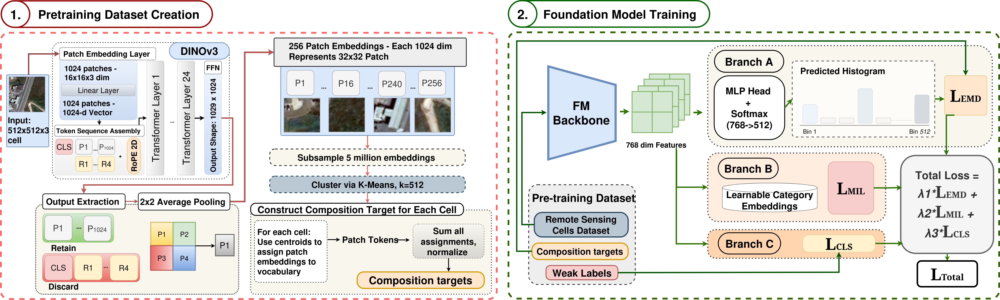

# A Composition-Aware Pretraining Framework for Geospatial Foundation Models

Geospatial foundation models have emerged as state-of-the-art methods for downstream Earth observation tasks. However, existing pretraining methodologies process imagery through a single-concept lens, failing to capture the highly compositional nature of complex satellite scenes. We propose a composition-aware pretraining framework that explicitly encodes fractional land-cover mixtures. Each satellite image cell is mapped to a histogram representing its fractional land-cover distribution, which we term the "composition target". These targets serve as the primary prediction objective and are distilled into the backbone using Earth Mover's Distance. Experimental evaluation shows that composition-aware pretraining yields substantial gains on region-level understanding tasks requiring semantic similarity judgment, including zero-shot image retrieval and scene classification, while remaining competitive on tasks requiring fine-grained spatial precision, such as segmentation and object detection.



## Installation

### 1. Environment

The conda environment (Python 3.11 + CUDA 12.1) is pinned in `environment.yaml`:

```bash
conda env create -f environment.yaml
conda activate dynamicvis
```

### 2. DynamicVis dependency

Training and evaluation scripts import the
[DynamicVis](https://github.com/KyanChen/DynamicVis) codebase, which is kept out
of this repository. Clone it into `architectures/`:

```bash
git clone https://github.com/KyanChen/DynamicVis.git architectures/DynamicVis
```

### 3. PYTHONPATH

Scripts import from both the repository root and `architectures/DynamicVis`.
Export PYTHONPATH (add it to `~/.bashrc` to persist):

```bash
export PYTHONPATH="$(pwd):$(pwd)/architectures/DynamicVis:${PYTHONPATH:-}"
```

### 4. Model weights

The `weights/` directory is git-ignored, so download any checkpoints you need
and place them there:

- **DINOv3 ViT-L/16** — required for BoVW patch-token extraction (Phase 1) and
  histogram generation (Phase 3). Defaults to
  `weights/dinov3_vitl16_pretrain_sat493m-eadcf0ff.pth`; override with
  `--weights-path`.
- **DynamicVis backbone** — optional for BoVW training (Phase 4). Pass it with
  `--pretrained-backbone`, or train from scratch with `--no-pretrained`.

### 5. Weights & Biases (optional)

Training scripts log to W&B by default. Set `WANDB_API_KEY` (optionally also
`WANDB_PROJECT` / `WANDB_ENTITY`) in the environment, or pass `--no-wandb` to
disable logging.

## fMoW Dataset

Uses the fMoW with 63 land-use categories. The BoVW pipeline uses
cell-level training targets built from DINOv3 patch embeddings.

Expected local layout (after download):
```
data/fmow/train/<category>/<location>/*.jpg
data/fmow/val/<category>/<location>/*.jpg
```
Common manifests already in this repository:

- data/fmow_manifest_train.json
- data/fmow_manifest_val.json

Download examples:

```bash
# 10% stratified sample by class (fast smoke test)
python scripts/download_fmow.py --output-dir data/fmow --split train --fraction 0.1

# 50% stratified sample (recommended for iterative work)
python scripts/download_fmow.py --output-dir data/fmow --split train --fraction 0.5

# Full RGB download (large)
python scripts/download_fmow.py --output-dir data/fmow --split train --use-rgb

# Validation split
python scripts/download_fmow.py --output-dir data/fmow --split val --fraction 0.5
```

Notes:

- download_fmow.py defaults to msrgb unless --use-rgb is provided.
- Keep manifest and local data layout consistent across BoVW phases.


### Pretraining

Run the following in order.

```bash
# Phase 1: extract DINOv3 patch tokens from fMoW cells
python scripts/extract_patch_tokens.py \
    --data-root data/fmow \
    --manifest data/fmow_manifest_train.json \
    --output-dir outputs/patch_tokens_bovw \
    --weights-path weights/dinov3_vitl16_pretrain_sat493m-eadcf0ff.pth \
    --batch-size 64 \
    --resume

# Phase 2: build visual vocabulary with FAISS k-means
python scripts/build_vocabulary.py \
    --patch-token-dir outputs/patch_tokens_bovw \
    --output-dir outputs/bovw_vocabulary \
    --K 512 \
    --subsample 5000000

# Phase 3: generate soft histogram targets
python scripts/generate_histograms.py \
    --patch-token-dir outputs/patch_tokens_bovw \
    --vocab-dir outputs/bovw_vocabulary \
    --manifest data/fmow_manifest_train.json \
    --output-dir outputs/bovw_histograms \
    --weights-path weights/dinov3_vitl16_pretrain_sat493m-eadcf0ff.pth \
    --data-root data/fmow \
    --beta 10.0 \
    --workers 8 \
    --resume

# Phase 3b: derive per-cell class labels from manifest paths
python scripts/extract_manifest_labels.py \
    --manifest data/fmow_manifest_train.json \
    --output-dir outputs/bovw_histograms

# Phase 4: train DynamicVis with BoVW objective
python train_dynamicvis_bovw.py \
    --manifest data/fmow_manifest_train.json \
    --histogram-dir outputs/bovw_histograms \
    --vocab-dir outputs/bovw_vocabulary \
    --cell-labels outputs/bovw_histograms/cell_labels.npy \
    --data-root data/fmow \
    --output-dir outputs/bovw_training \
    --batch-size 32 \
    --num-epochs 100 \
    --lr 5e-4
```

Notes:

- Phase 1 runs in a single process by default. To shard extraction across
  multiple GPUs, launch one process per GPU with `--shard-index <i>` and
  `--num-shards <N>`.
- For multi-GPU Phase 4 training, prefix the command with
  `torchrun --nproc_per_node=<N> train_dynamicvis_bovw.py ...`.
- Everything above is plain Python — no Slurm cluster is required.

### Phase Outputs

| Phase | Script | Main Outputs |
|---|---|---|
| 1 | scripts/extract_patch_tokens.py | outputs/patch_tokens_bovw/*.npz |
| 2 | scripts/build_vocabulary.py | outputs/bovw_vocabulary/centroids.npy, ground_cost.npy |
| 3 | scripts/generate_histograms.py | outputs/bovw_histograms/histograms.npy, cell_ids.npy |
| 3b | scripts/extract_manifest_labels.py | outputs/bovw_histograms/cell_labels.npy |
| 4 | train_dynamicvis_bovw.py | outputs/bovw_training*/final_model.pth, final_backbone.pth |


## Downstream Evaluation (eval/)

### 1) CBIR Retrieval (AID / ForestNet)

Entry point:

- eval/cbir/main.py

What it does:

- Extracts embeddings with the model adapter in eval/adapters/.
- Builds or loads a FAISS index.
- Reports Recall@K and mAP@K.

Run commands:

```bash
# AID retrieval (stratified k-fold)
python eval/cbir/main.py \
    --dataset aid \
    --data_dir data/eval/AID \
    --model_path outputs/bovw_training_8262/epoch_20.pth \
    --config_path architectures/DynamicVis/configs_DynamicVis/AID/dynamicvis_b_aid_mamba.py

# ForestNet retrieval
python eval/cbir/main.py \
    --dataset forestnet \
    --data_dir data/eval/deep/downloads/ForestNetDataset \
    --model_path outputs/bovw_training_8262/epoch_20.pth \
    --config_path architectures/DynamicVis/configs_DynamicVis/AID/dynamicvis_b_aid_mamba.py
```

### 2) UC Merced Scene Classification

Entry point:

- eval/ucmerced/main.py

What it does:

- Freezes the foundation backbone.
- Extracts pooled features.
- Trains a lightweight linear/MLP head.
- Reports Top-1/Top-5, precision, recall, F1.

Run commands:

```bash
# Fixed split
python eval/ucmerced/main.py \
    --model_path outputs/bovw_training_8262/epoch_20.pth \
    --split_mode fixed

# Stratified k-fold
python eval/ucmerced/main.py \
    --model_path outputs/bovw_training_8262/epoch_20.pth \
    --split_mode kfold \
    --num_folds 5
```

### 3) LEVIR-CD Change Detection

Entry point:

- eval/change-detection/main.py

What it does:

- Uses DynamicVis as a Siamese feature backbone.
- Adds an FPN-style fusion neck and CD prediction head.
- Trains/evaluates on LEVIR-CD with precision/recall/F1/IoU metrics.

Run commands:

```bash
# Train + evaluate
python eval/change-detection/main.py \
    --backbone-checkpoint outputs/bovw_training_8262/epoch_20.pth \
    --num-epochs 5

# Evaluate only from saved CD checkpoint
python eval/change-detection/main.py \
    --eval-only \
    --backbone-checkpoint outputs/bovw_training_8262/epoch_20.pth \
    --cd-checkpoint-path outputs/change_detection/best_cd_model.pth
```

### 4) LEVIR-ship Object Detection

Entry point:

- eval/object-detection/main.py

What it does:

- Uses DynamicVis (loaded from BoVW checkpoints) as the Faster R-CNN backbone.
- Trains/evaluates on LEVIR-ship YOLO-format labels.
- Reports mAP at multiple IoU thresholds and saves prediction visualizations.

Run commands:

```bash
# Train + evaluate on LEVIR-ship
python eval/object-detection/main.py \
    --data-root data/eval/object-det \
    --backbone-checkpoint outputs/bovw_training_8262/epoch_20.pth \
    --num-epochs 5

# Evaluate only from a saved detector checkpoint
python eval/object-detection/main.py \
    --eval-only \
    --data-root data/eval/object-det \
    --backbone-checkpoint outputs/bovw_training_8262/epoch_20.pth \
    --detector-checkpoint outputs/object_detection/best_detector.pth
```


## Other Training Modes

- Vanilla pretrain (bbox-supervised DynamicVis):

  ```bash
  python train_dynamicvis_pretrain.py configs_dynamicvis/fmow_pretrain/dynamicvis_b_fmow_s3_pretrain.py \
      --work-dir outputs/fmow_dynamicvis_b_s3 \
      --batch-size 128 \
      --epochs 100 \
      --lr 1e-4
  ```

  For multi-GPU training, prefix with `torchrun --nproc_per_node=<N>` and add
  `--launcher pytorch`.


